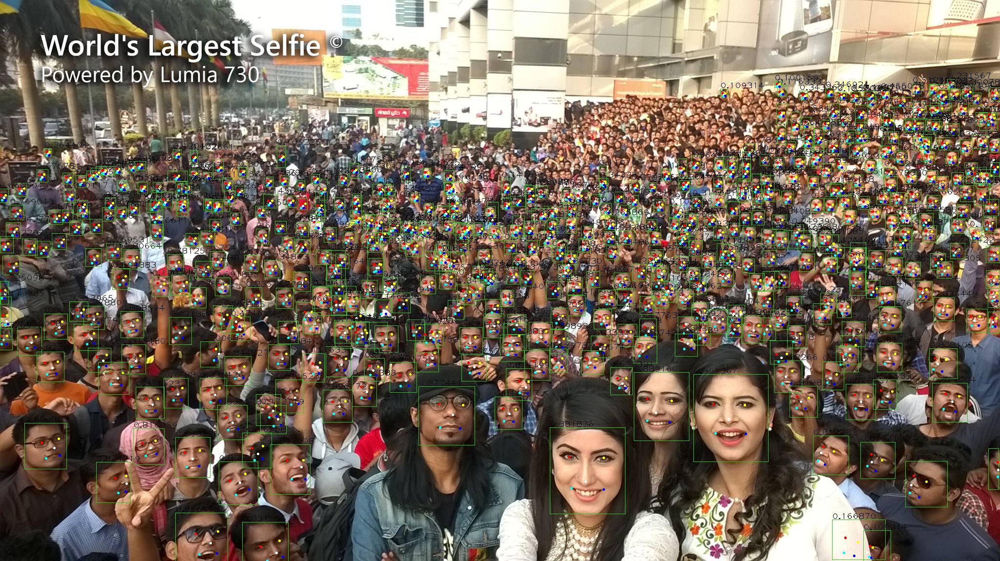
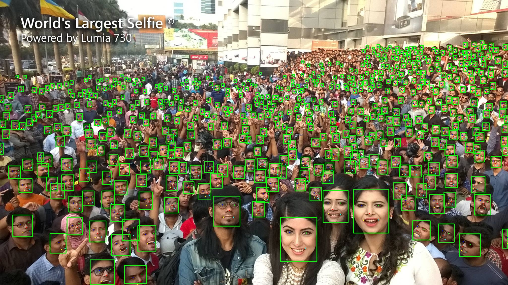
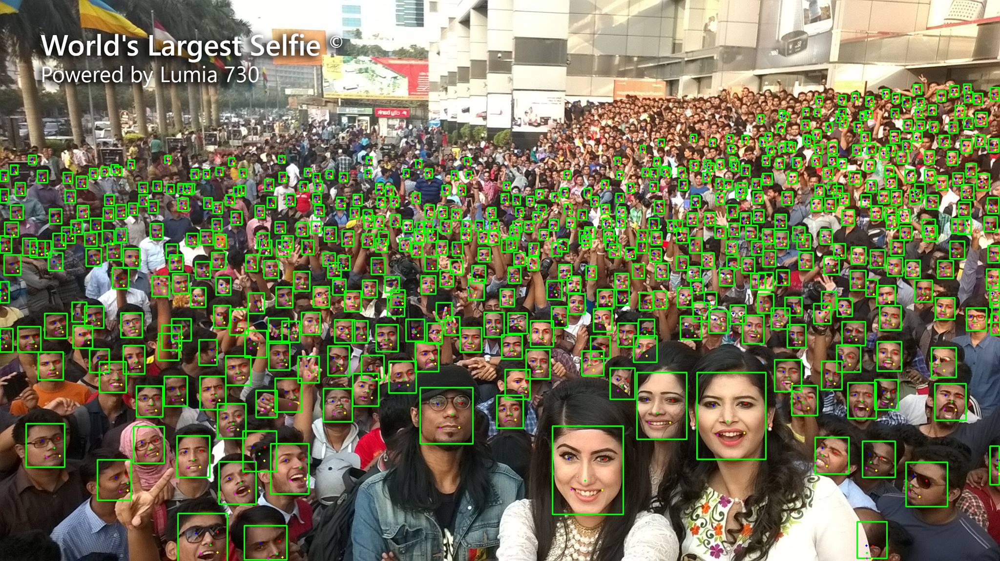
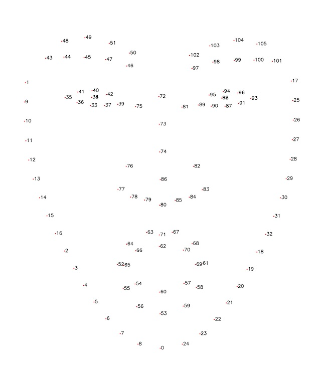
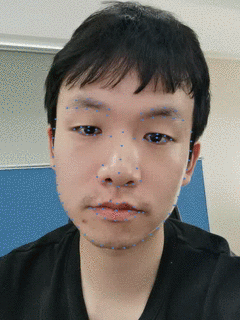
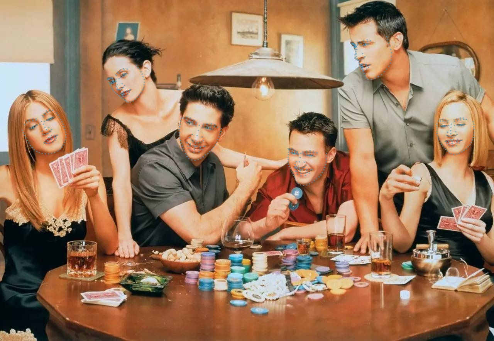

简体中文 | [English](./README_en.md)

如果觉得有用，不妨给个Star⭐️🌟支持一下吧~ 谢谢！

# Acknowledgments & Contact 
### 1.WeChat ID: cbp931126
加我微信#(备注：FaceAlgorithm),拉进群
### 2.QQ Group：517671804


# FaceAlgorithm
## 特性
1. 人脸检测(retinaface,yolov5face,yolov7face,yolov8face),人脸旋转角度计算(俯仰角，偏航角)，人脸矫正，人脸识别，带口罩识别，年龄性别识别，静默活体识别;
2. 所有模型均使用C++和TensorRT加速推理,yolov7face的前后处理使用cuda加速,(其他模型加速优化也可参考);
3. 所有模型使用C++和OnnxRuntime.OpenVINO,NCNN加速推理(TO DO);
4. 构造类似NV Deepstream，支持多种推理框架(TensorRT,OnnxRuntime,OpenVINO,NCNN)，用于多路RTSP拉流+硬解码+Pipeline+推流(TO DO);
5. 根据不同的显卡型号自动生成对应的engine(如果文件夹下有其他显卡适配engine，则删除engine才能重新生成使用中的显卡对应的engien);
6. 提供C/C++接口，可以直接移植在项目里;
7. 人脸识别一般流程:

	1)人脸检测(图像、视频流)
			
	2)根据每个人脸返回的角度，筛选出合适角度的人脸用于人脸矫正，人脸识别

	3)人脸矫正(根据5个人脸关键点)
			
	4)人脸特征特征提取（512维特征）
					
	5)人脸特征比对(人脸相似度计算)

8. 条件编译测试说明
	| 测试类别 |  enable    |  说明   |
	|:----------|:----------|:----------|
   |face_detect                        |1|           人脸检测                         |
   |yolov5face_detect				      |1|           yolov5face 人脸检测              |
   |yolov7face_detect				      |1|           yolov7face 人脸检测              |
   |yolov8face_detect				      |1|           yolov8face 人脸检测              |
   |face_recognition                   |1|           人脸识别（人脸特征提取）+相似度计算   |
   |face_detect_tracker                |1|           人脸检测跟踪                      |
   |face_detect_aligner_recognitiion   |0|           人脸检测——矫正——识别(人脸特征提取)   |
   |mask_recognition                   |1|           口罩识别                         |
   |gender_age_recognition             |1|           性别年龄识别                      |
   |silnet_face_anti_spoofing          |1|           静默活体检测                      |

## 算法说明
### 1人脸检测
#### 1)人脸检测retinaface(mobilenet0.25,R50需要自己修改代码）
   
#### 2)yolov5face(yolov5sface(640*640)，n,m,l,x需要自己转换对应的onnx)
    
   
#### 3)yolov7face(yolov7sface(640*640),另外不同大小的模型需要自己转换)
   

#### 4)yolov8facee(yolov8nface(640*640),另外不同大小的模型需要自己转换)
   

#### 5) ***Large family***
| Method              | Backbone       | Easy  | Medium | Hard  | \#Params(M) | \#Flops(G) |
|:-------------------:|:--------------:|:-----:|:------:|:-----:|:-----------:|:----------:|
| RetinaFace (CVPR20) | ResNet50       | 94.92 | 91.90  | 64.17 | 29.50       | 37.59      |
| ***YOLOv5s***       | CSPNet         | 94.67 | 92.75  | 83.03 | 7.075       | 5.751      |
| **YOLOv5s6**        | CSPNet         | 95.48 | 93.66  | 82.8  | 12.386      | 6.280      |
| ***YOLOv5m***       | CSPNet         | 95.30 | 93.76  | 85.28 | 21.063      | 18.146     |
| **YOLOv5m6**        | CSPNet         | 95.66 | 94.1   | 85.2  | 35.485      | 19.773     |
| ***YOLOv5l***       | CSPNet         | 95.78 | 94.30  | 86.13 | 46.627      | 41.607     |
| ***YOLOv5l6***      | CSPNet         | 96.38 | 94.90  | 85.88 | 76.674      | 45.279     |
| ***yolov7-tiny***   | 640            | 94.7  | 92.6   | 82.1  |  13.2       | -          | 
| ***yolov7s***       | 640            | 94.8  | 93.1   | 85.2  |  16.8       | -          |
| ***yolov7***        | 640            | 96.9  | 95.5   | 88.0  |  103.4      | -          |
| ***yolov7+TTA***    | 640            | 97.2  | 95.8   | 87.7  |  103.4      | -          |
| ***yolov7-w6***     | 960            | 96.4  | 95.0   | 88.3  |  89.0       | -          |
| ***yolov7-w6+TTA*** | 1280           | 96.9  | 95.8   | 90.4  |  89.0       | -          |
| ***yolov8s***       | 640            | 96.0  | 94.2   | 82.6  |  -          | -          | 
| ***yolov8m***       | 640            | 96.6  | 95.0   | 84.1  |  -          | -          |

#### 6) ***Small family***

| Method               | Backbone        | Easy  | Medium | Hard  | \#Params(M) | \#Flops(G) |
| -------------------- | --------------- | ----- | ------ | ----- | ----------- | ---------- |
| RetinaFace (CVPR20   | MobileNet0.25   | 87.78 | 81.16  | 47.32 | 0.44        | 0.802      |
| FaceBoxes (IJCB17)   |                 | 76.17 | 57.17  | 24.18 | 1.01        | 0.275      |
| ***YOLOv5n***        | ShuffleNetv2    | 93.74 | 91.54  | 80.32 | 1.726       | 2.111      |
| ***YOLOv5n-0.5***    | ShuffleNetv2    | 90.76 | 88.12  | 73.82 | 0.447       | 0.571      |
| ***yolov7-lite-t***  |                 | 88.7  | 85.2   | 71.5  |  0.8        |            |
| ***yolov7-lite-s***  |                 | 92.7  | 89.9   | 78.5  |  3.0        |  -         |
| ***yolov8-lite-t***  | 640             | 90.3  | 87.5   | 72.8  |  -          |  -         |
| ***yolov8-lite-s***  | 640             | 93.4  | 91.1   | 77.7  |  -          |  -         |
| ***yolov8n***        | 640             | 94.5  | 92.2   | 79.0  |  -          |  -         |
#### 7) TensorRT

|   Backbone   | Pytorch(1.10.0+cu102) | TensorRT_FP16(RTX2080Ti) |TensorRT_FP16(RTX3090)@640|
| :----------: | :---------: | :---------------: |:---------------: |
| yolov5n-0.5  |     7.7 ms     |        2.1 ms       |             |                 |
| yolov5n-face |     7.7 ms     |        2.4 ms       |             |                 |
| yolov5m-face |     9.9 ms     |        3.3 ms       |             |                 |
| yolov5l-face |    15.9 ms     |        4.5 ms       |             |                 |
| RetinaFace   |      -         |         -           |  1.38ms (前后处理+推理+人脸角度计算)     |
| yolov5s-face |     5.6 ms     |        2.2 ms       |  1.47ms (前后处理+推理+人脸角度计算)     |
| yolov7s-face |     -          |        -            |  1.69ms (前后处理+推理+人脸角度计算)     |
| yolov8n-face |     -          |        -            |  1.03ms (前后处理+推理+人脸角度计算)     |

### 2.人脸识别

#### 1) arcface(R50)

#### 2)arcface(R101,需要自己下载模型修改代码)
<div align="left">
  
</div>


### 3.带口罩识别
#### 1)检测->裁剪->识别(分类模型)


### 4.年龄性别
#### 1)人脸检测->裁剪->年龄和性别识别
<div align="left">
  
</div>

### 5.静默活体识别
#### 1)Silent-Face-Anti-Spoofing
   
|name| sample| result |image| sample| result |
|:----------:|:----------:|:----------:|:----------:|:----------:|:----------:|
0.jpg||fake|1.jpg||fake
2.jpg||real|3.jpg||real
4.jpg||fake|5.jpg||fake

### 6.FaceAlignment
<p align="center">Points mark-up(ordered by point names):</p>
<div align="center">
	
   
</div>
<p align="center">Image result:</p>
<div align="center">
	
</div>


### 7.跟踪
#### 1)ByteTracker(加上人脸bbox和人脸关键点作为跟踪的输入，修改Bug)

# 算法接口
```
/** 
 * @brief               人脸初始化函数
 * @param config        模块配置参数结构体
 * @return              HZFLAG
 */
HZFLAG Initialize(Config& config);


/** 
 * @brief               人脸检测
 * @param img           opencv　Mat格式
 * @param FaceDets      人脸检测结果列表，包括人脸bbox，置信度，五个关键点坐标
 * @return              HZFLAG
 */		
HZFLAG Face_Detect(std::vector<cv::Mat>&img, std::vector<std::vector<FaceDet>>&FaceDets);


/** 
 * @brief               人脸检测(yolov5_face)
 * @param img           opencv　Mat格式
 * @param FaceDets      人脸检测结果列表，包括人脸bbox，置信度，五个关键点坐标
 * @return              HZFLAG
 */		
HZFLAG Yolov5Face_Detect(std::vector<cv::Mat>&img, std::vector<std::vector<FaceDet>>&FaceDets);

/** 
   * @brief             人脸检测(yolov7_face)
   * @param img         opencv　Mat格式
   * @param FaceDets    人脸检测结果列表，包括人脸bbox，置信度，五个关键点坐标
   * @return            HZFLAG
   */		
HZFLAG Yolov7Face_Detect(std::vector<cv::Mat>&img, std::vector<std::vector<FaceDet>>&FaceDets);

/** 
   * @brief             人脸检测(yolov8_face)
   * @param img         opencv　Mat格式
   * @param FaceDets    人脸检测结果列表，包括人脸bbox，置信度，五个关键点坐标
   * @return            HZFLAG
   */		
HZFLAG Yolov8Face_Detect(std::vector<cv::Mat>&img, std::vector<std::vector<FaceDet>>&FaceDets);

/** 
 * @brief               人脸检测跟踪(视频流)
 * @param img           opencv　Mat格式
 * @param FaceDets      FaceDets	人脸检测结果列表，包括人脸bbox，id,置信度，偏航角度，俯仰角度，五个关键点坐标
 * @return              HZFLAG
 */	
HZFLAG Face_Detect_Tracker(std::vector<cv::Mat>&img, std::vector<std::vector<FaceDet>>&FaceDets);


/** 
 * @brief               人脸矫正
 * @param Faceimg       需要矫正的人脸图像(矩形框bbox外扩1.2倍得到的人脸图像然后进行矫正!!!!)
 * @param KeyPoints     人脸关键点
 * @param Face_Aligener 矫正之后的图像
 * @return              HZFLAG
 */	
HZFLAG Face_Aligner(cv::Mat&Face_image,cv::Point2f *KeyPoints,cv::Mat&Face_Aligener);

/** 
 * @brief               人脸特征提取
 * @param Face_Aligener 经过人脸矫正的人脸图像
 * @param Face_Feature  人脸特征(512维特征)
 * @return              HZFLAG
 */		
HZFLAG Face_Feature_Extraction(cv::Mat&Face_Aligener,Feature&Face_Feature);


/** 
 * @brief               计算人脸特征的相似度
 * @param Feature1      经过人脸矫正的人脸图像
 * @param Feature2      人脸特征(512维特征)
 * @return float        相似度得分               
 */	
float Cal_Score(Feature&Feature1,Feature&Feature2);

/** 
 * @brief               人脸戴口罩识别
 * @param img           需要识别的人脸戴口罩图像
 * @param Result        人脸戴口罩识别结果
 * @return              HZFLAG
 */
HZFLAG Mask_Recognition(cv::Mat &img,float&pred);

/** 
 * @brief               性别年龄识别
 * @param img           需要识别的人脸图像
 * @param Result        性别年龄识别别结果
 * @return              HZFLAG
 */
HZFLAG Gender_Age_Recognition(cv::Mat &img,attribute&gender_age);

/** 
 * @brief               静默活体检测
 * @param img           需要检测的人脸图像
 * @param Result        静默活体检测识别结果
 * @return              HZFLAG
 */
HZFLAG Silent_Face_Anti_Spoofing(cv::Mat&img, SilentFace&silentface);

/** 
 * @brief               反初始化
 * @return              HZFLAG
 */		
HZFLAG Release(Config& config);
```
# 使用方法
## 1.模型和测试数据下载
模型和测试数据 ([Baidu Drive](https://pan.baidu.com/s/1pHecUT0vIDVb4oaB7FZbqQ)code: umme)
| name |  功能    |  说明   |
|:----------:|:----------:|:----------:|
|FaceDetect.wts                        |人脸检测|        
|FaceRecognition.wts				   |人脸识别|       
|GenderAge.onnx                        |年龄性别识别|          
|MaskRecognition.onnx                  |口罩识别|          
|yolov5s-face_bs=1.onnx                |yolov5s人脸检测|          
|yolov5s-face_bs=4.onnx                |yolov5s人脸检测| bs=4
|yolov7s-face_bs=1.onnx                |yolov7s人脸检测|          
|yolov7s-face_bs=4.onnx                |yolov7s人脸检测| bs=4
|yolov8n-face_bs=1.onnx                |yolov8n人脸检测|          
|yolov8n-face_bs=4.onnx                |yolov8n人脸检测| bs=4        
|2.7_80x80_MiniFASNetV2.onnx           |静默活体检测|
|2d106det_bs=1.onnx                    |106keypoints|   bs=1          

## 2.环境
1. ubuntu20.04+cuda11.1+cudnn8.2.1+TrnsorRT8.2.5.1(测试通过)
2. ubuntu18.04+cuda10.2+cudnn8.2.1+TrnsorRT8.2.5.1(测试通过)
3. Win10+cuda11.1+cudnn8.2.1+TrnsorRT8.2.5.1      (测试通过)
4. 其他环境请自行尝试或者加群了解


## 3.编译

1. 更改根目录下的CMakeLists.txt,设置tensorrt的安装目录
```
set(TensorRT_INCLUDE "/xxx/xxx/TensorRT-8.2.5.1/include" CACHE INTERNAL "TensorRT Library include location")
set(TensorRT_LIB "/xxx/xxx/TensorRT-8.2.5.1/lib" CACHE INTERNAL "TensorRT Library lib location")
```
2. 默认opencv已安装，cuda,cudnn已安装
3. 为了Debug默认编译 ```-g O0``` 版本,如果为了加快速度请编译Release版本

4. 使用Visual Studio Code快捷键编译(4,5二选其一):
```
   ctrl+shift+B
```
5. 使用命令行编译(4,5二选其一):
```
   mkdir build
   cd build
   cmake ..
   make -j6
```
 

# References
1. https://github.com/deepcam-cn/yolov5-face
2. https://github.com/wang-xinyu/tensorrtx
3. https://github.com/minivision-ai/Silent-Face-Anti-Spoofing
4. https://github.com/linghu8812/tensorrt_inference
5. https://github.com/derronqi/yolov7-face/tree/main
6. https://github.com/we0091234/yolov7-face-tensorrt
7. https://github.com/deepinsight/insightface
8. https://github.com/derronqi/yolov8-face   
